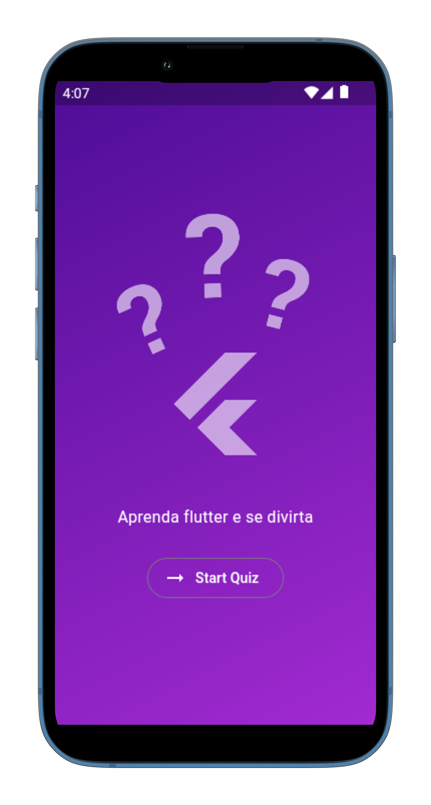
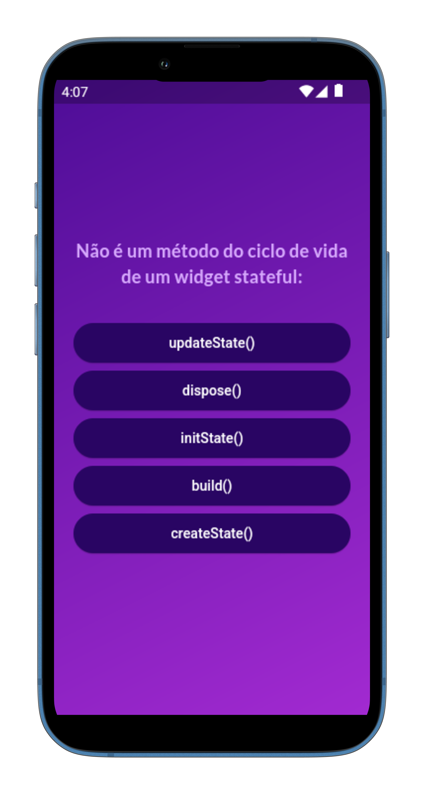
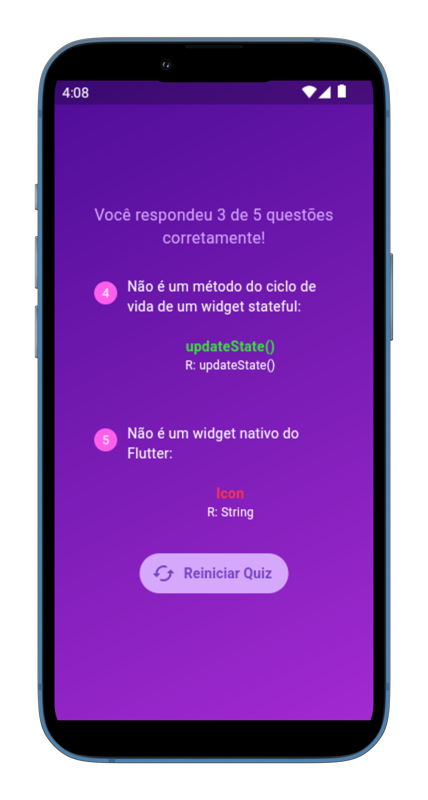

# Flutter Quiz

## Aprenda Flutter e se divirta ao mesmo tempo!

Projeto pessoal desenvolvido para aprender a desenvolver aplicações utilizando o framework **Flutter**.

Quaisquer sugestões de possíveis melhorias sempre são bem-vindas.

## Sobre o projeto

### Breve descrição 

O projeto se trata de um aplicativo em que o usuário é desafiado a testar suas habilidades em **Flutter**, respondendo a um quiz.

Ao iniciar o questionaŕio, são exibidas uma série de perguntas, sendo que há apenas uma alternativa correta associada a cada, e a mesma se encontra embaralhada aleatoriamente junto as demais opções de escolha disponíveis.

O usuário deve responder corretamente o máximo possível de questões e, ao final, é mostrado na tela a pontuação atingida pelo mesmo. Caso não esteja satisfeito com o resultado, o jogador tem a chance de reiniciar o quiz e se provar novamente.